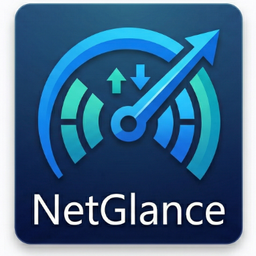
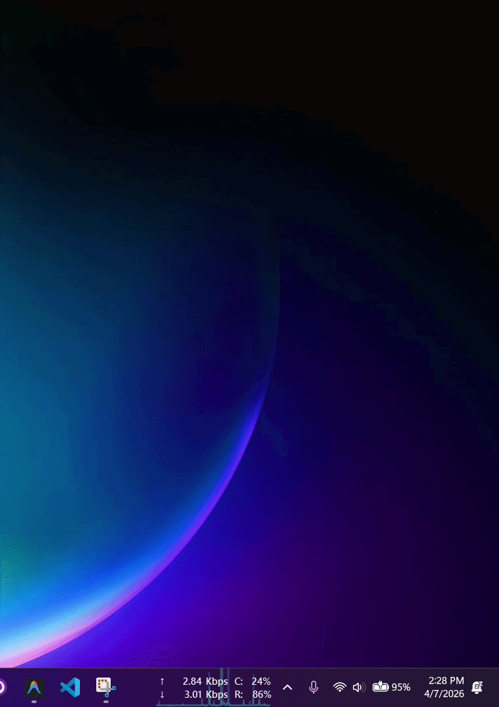

# NetGlance

<p align="center">
  
</p>

<p align="center">
  <a href="https://apps.microsoft.com/detail/9PPS4P9GXVMT">
    
  </a>
</p>

<p align="center">
  
  
  
  
</p>
<p align="center"><a href="https://sowmik.pages.dev/donate"></a></p>

**NetGlance** brings the clean, detailed, macOS-style network monitoring experience (similar to iStat Menus) directly to the Windows taskbar. 

It features a lightweight, persistent taskbar overlay showing live upload and download speeds, paired with a modern, frameless pop-up dashboard for detailed analytics, historical graphs, and connection details.

## ✨ Features

* **Taskbar Overlay:** Real-time upload and download speeds embedded directly over your Windows taskbar.
* **System Tray Icon:** A proper notification area icon with quick-access context menu, following Windows conventions.
* **macOS-Style Dashboard:** A frameless, beautifully styled pop-up triggered via the system tray.
* **Real-Time Analytics:**
  * Live historical usage graphing (powered by `pyqtgraph`).
  * Total data usage tracking per session.
  * Local IP, physical MAC address, and active interface details.
  * Live latency (ping) and jitter monitoring.
* **2× Faster Updates:** 0.5s polling interval for near-instant speed readings.
* **Highly Optimized:** Uses vectorized data processing to ensure near-zero CPU footprint.
* **Theme Adaptive:** Blends natively with Windows light and dark modes.

## 📸 NetGlance Demo
<p align="center">
  
</p>

## 🚀 Installation & Usage

### Get it from Microsoft Store (Recommended)
The easiest way to install and stay updated is through the Microsoft Store:
<a href="https://apps.microsoft.com/detail/9PPS4P9GXVMT">
  
</a>

### Using WinGet (Fastest CLI)
Go to windows terminal and run:

```
winget install sowmiksudo.Netglance
```

### Manual Download
You do not need to install Python to use this app. 
1. Go to the [Releases](../../releases) page.
2. Download the latest `NetGlance-Setup.exe` or the portable `.zip`.
3. Run the executable. The widget will automatically appear in your taskbar!

### For Developers (Build from Source)
If you want to run the code directly or contribute to the project:

1. Clone the repository:
```bash
git clone [https://github.com/sowmiksudo/NetGlance.git](https://github.com/sowmiksudo/NetGlance.git)
cd NetGlance

```

2. Create and activate a virtual environment:
```bash
python -m venv venv
venv\Scripts\activate

```


3. Install the dependencies:
```bash
pip install -r requirements.txt

```


4. Run the application:
```bash
python src/monitor.py

```


## 🛠️ How it Works

* **Double Left-Click** the system tray icon to toggle the detailed Analytics Dashboard.
* **Right-Click** the system tray icon to access Settings or Exit the application.
* **Click and Drag** the taskbar overlay to reposition it if needed.

## 🙏 Acknowledgements & Credits

This project was built to expand upon the fantastic work done by the open-source community.

A massive thanks to **[erez-c137](https://github.com/erez-c137)**. The core network monitoring engine, Z-order taskbar positioning logic, and high-performance data vectorization in this application are heavily based on his brilliant [NetSpeedTray](https://github.com/erez-c137/NetSpeedTray) project. If you are looking for a purely minimalist network monitor, I highly recommend checking out his original repo!

## 📜 License

This project is licensed under the **GNU General Public License v3.0 (GPLv3)**.
See the [LICENSE](https://www.google.com/search?q=LICENSE) file for details.

As a copyleft license, this guarantees that the software remains free and open-source forever. Any modifications or derivative works distributed from this codebase must also be open-source and licensed under GPLv3.

---

*Created by Shayer Mahmud Sowmik*
